## Introduction

Customer segmentation describes the process of separating customers
into different groups based on characteristics such as social factors,
demographics, or behavioral preferences.
It is an important task in marketing and business understanding and is
therefore a popular application for clustering techniques.

In this data science project, we use k-means clustering for customer
segmentation on this 
<a href="https://www.kaggle.com/vjchoudhary7/customer-segmentation-tutorial-in-python">mall customers segmenentation data</a>,
which was part of a kaggle competition.

## Data Analysis

Before implementing the clustering algorithms, we conduct a quick data analysis.
The dataset is small and consists of 200 rows and 5 columns, namely
`CustomerID`, `Age`, `Annual Income (k$)`, and `Spending Score (1-100)`.
In order to work conveniently with the data, we drop the `CustomerID` column
(since it contains no information) and rename the remaining columns to `gender`,
`age`, `income`, and `spending_score`.
Since there are no missing values, the dataset is prepared for the analysis.

The first feature in the dataset is the `gender` of the customers.

  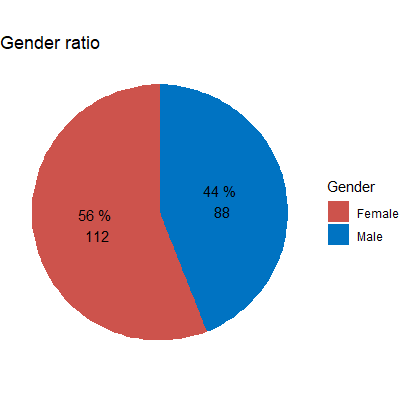

There are more female customers than male customers and there could be a variety
of reasons for that.
We do not have further information on the store itself, the items it sells,
its location, or the way the data are gathered, so we cannot analyse deeper.

For the `age` feature we look at a bar chart.
Since the dataset is small and not all ages are presented, we also look at a
histogram with a bin width of 5.

  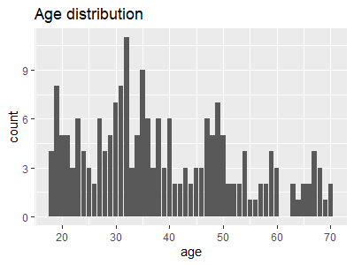
  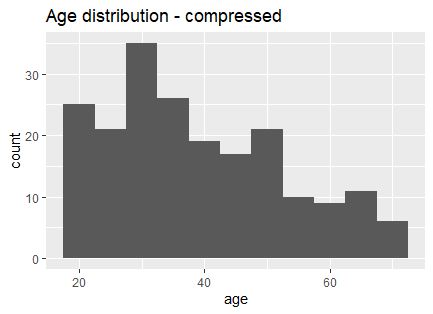

The distribution of age looks unsuspicious with some peaks around 20, 30, and 50.
Likely, these peaks would smooth out if the data set was larger.
Zooming into the age distribution by gender, we conclude that male customers
tend to be a bit older, but that there is no significant difference between the
genders.

  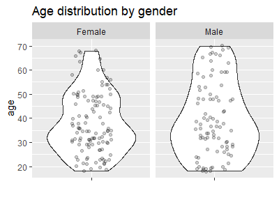

For the annual `income` the range is from 15 thousand up to 137 thousand, where
the majority is between 42 and 78.

  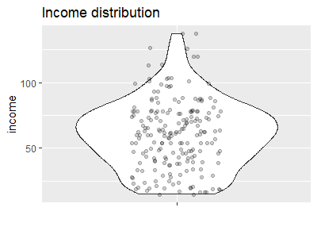

Comparing the income per gender, we conclude that male costumers have a slightly
higher income, but again there is no significant difference.
For the age groups the average income is more variant.
For the younger customers it is at its minimum and increases to a peak at around
age 40 and slightly increases afterwards.

  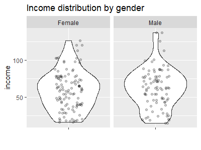
  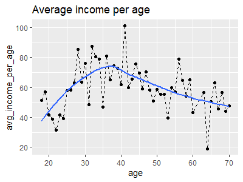

Finally, the histogram of the `spending_score` reveals that most of the
customers have a score between 25 and 75 which a higher concentration around 50.

  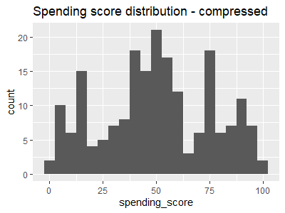

The distrubution dos not clearly change within the gender groups, but varies
along the customers age.
Young and old customers tend to have a higher score than the middle ages.

  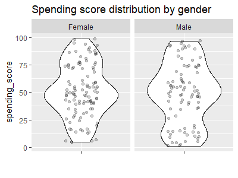
  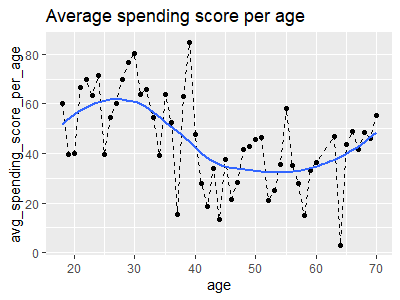

## Clustering

Before running the clustering algorithms, some preparation is needed.
First, all features have to be numerical, since distances are computed within
the clustering process.
This holds not true for the `gender` feature.
Since there are only two levels, we could reach a dummification by replacing the
levels by 0 and 1.
However, it is not clear how to interpret the distances here and since the
analysis has shown that there is no significant difference between these two
groups, we remove this feature for the clustering.

The next step is to check if there are correlations between the features, since
this can warp the clustering process.
If so, correlated features can be combined or a PCA can be used.
Checking `cor()`, indicates that there might be a small negative correlation
between `age` and `spneding_score`, which is in line with the preceding
analysis.
Since the correlation is small, we can keep all the features `age`, `income`,
and `spending_score` unchanged.

Finally, since distances are measured, the features need to be on the same scale.
A z-scoring transformation or min-max scaling are frequently used.
Here, we perform min-max scaling since we have no indication of normal
distributed features.

The k-means algorithm is one of the most popular clustering methods due to its
simplicity and low computational complexity.
Of course, other clustering methods are suitable for this problem.
In k-means clustering, the number of clusters has to be determined a priori and
is typically done by means of an elbow or silhouette plot.

  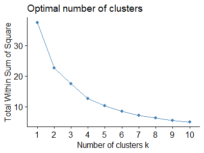
  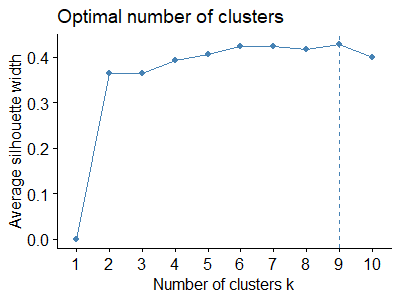

The elbow plot indicates for 4 clusters, whereas the silhoutte plot votes for 9.
The results for both variants, plotted against the first two principal components,
are shown below.
Since 9 cluster seem to high, we stick with 4 clsuter.

  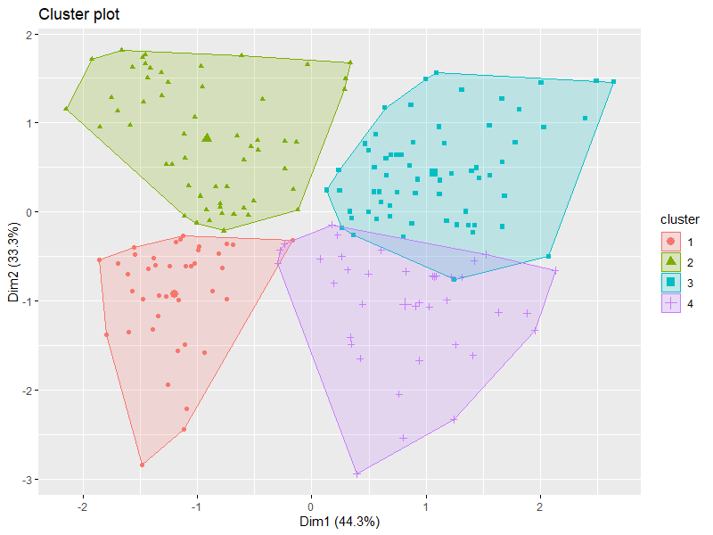
  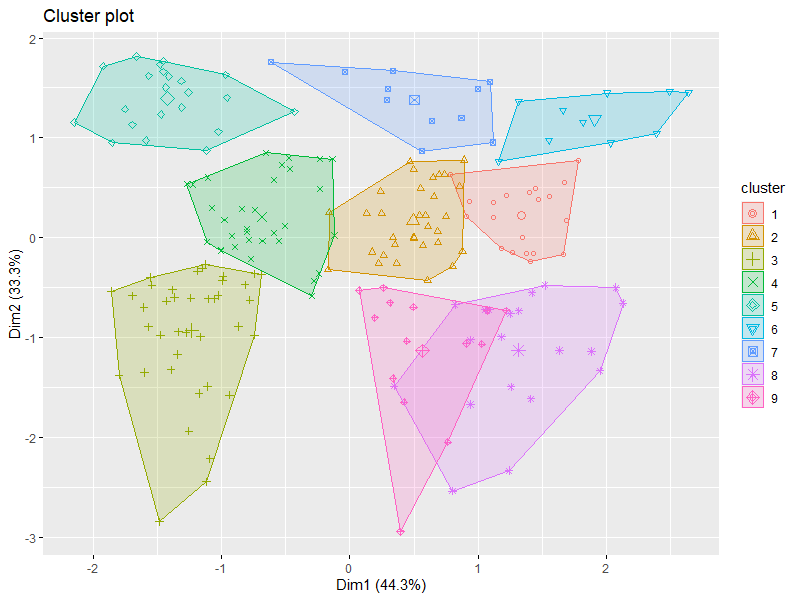

Since there are only three features, we can easily investigate there interaction.

  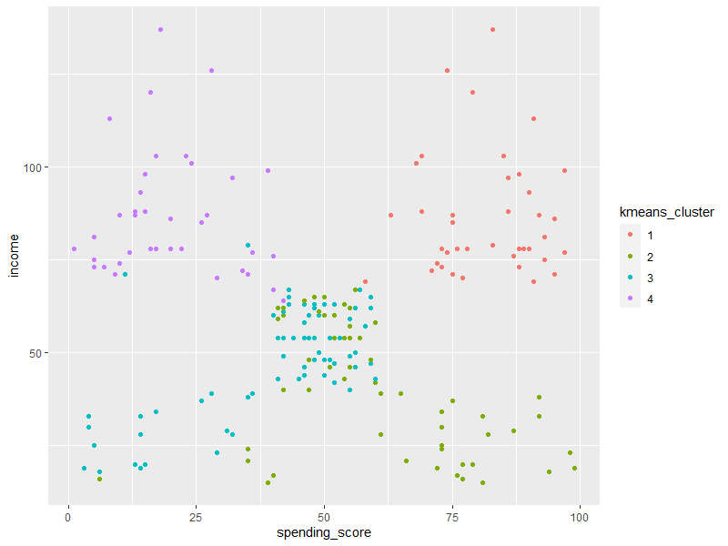
  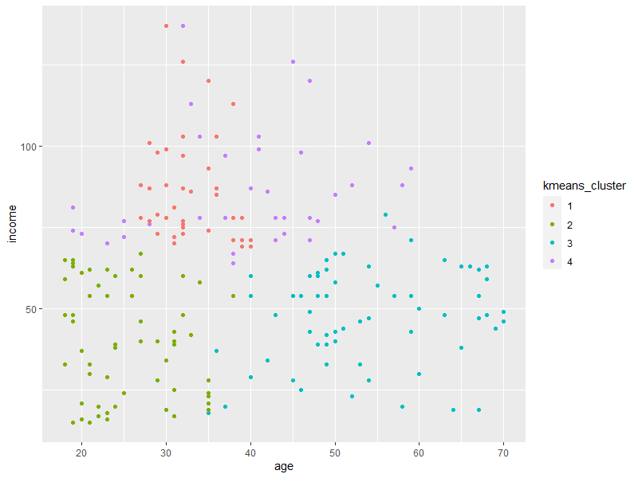
  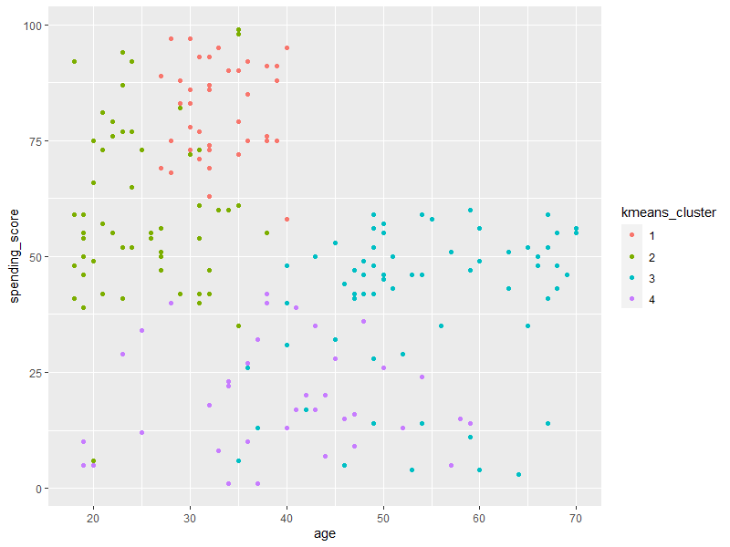

Considering the `age` feature, the clusters are fuzzy.
For `income` versus `spending_score`, only the clusters 2 and 3 mix.
Further, this plot indicates for 5 cluster rather than 4.

We therefore try a k-means clustering only on the features `income` and
`spending_score`.
As expected, the elbow plot indicates for 5 cluster now.

  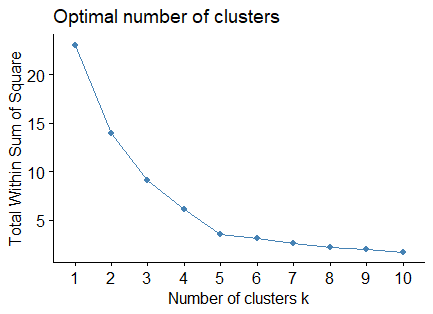

The resulting clusters are perfectly separated.

  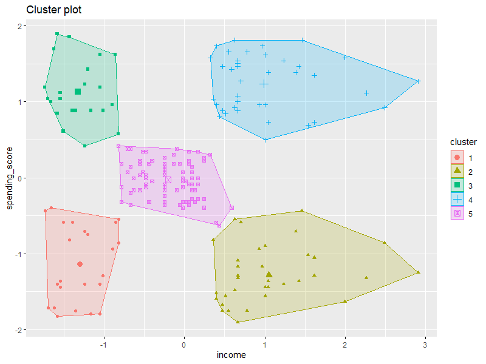

We can finally segment the customers into five subgroups:
  
  1. low income and low spending score
  2. high income and low spending score
  3. low income and high spending score
  4. high income and high spending score
  5. moderate income and moderate spending score
